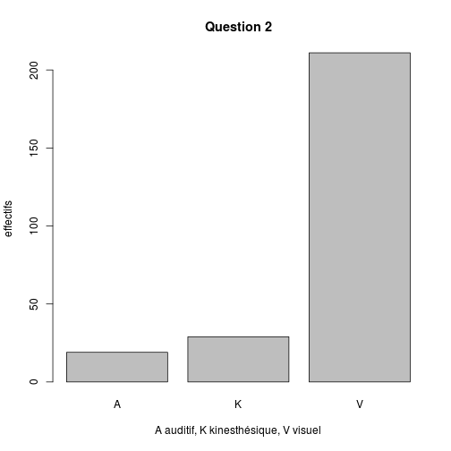

AVK Analyse
========================================================


```r
date()
```

```
## [1] "Tue Aug 20 15:56:29 2013"
```

```r
avk <- read.csv("../data/TABLEAU_AVK7.csv", header = TRUE, sep = ",")
names(avk)
```

```
##  [1] "candidat"           "metier"             "session"           
##  [4] "année.de.naissance" "sexe"               "Q2"                
##  [7] "Q3"                 "Q4"                 "Q5"                
## [10] "Q6"                 "Q7"                 "Q8"                
## [13] "Q9"                 "Q10"                "Q11"               
## [16] "Q12"                "Q13"                "Q14"               
## [19] "Q15"                "Q16"
```

```r
str(avk)
```

```
## 'data.frame':	259 obs. of  20 variables:
##  $ candidat          : int  1 2 3 4 5 6 7 8 9 10 ...
##  $ metier            : Factor w/ 6 levels "DEA","EIADE",..: 6 6 6 6 6 6 6 6 6 6 ...
##  $ session           : int  2013 2013 2013 2013 2013 2013 2013 2013 2013 2013 ...
##  $ année.de.naissance: int  1989 1990 1988 1990 1989 1989 1989 1989 1990 1989 ...
##  $ sexe              : Factor w/ 2 levels "F","H": 1 1 1 1 1 1 1 1 1 1 ...
##  $ Q2                : Factor w/ 3 levels "A","K","V": 3 3 3 1 2 3 3 3 3 2 ...
##  $ Q3                : Factor w/ 3 levels "A","K","V": 3 3 2 2 3 2 3 2 3 3 ...
##  $ Q4                : Factor w/ 3 levels "A","K","V": 2 1 3 3 1 1 1 1 1 1 ...
##  $ Q5                : Factor w/ 3 levels "A","K","V": 1 1 3 1 3 2 2 1 1 1 ...
##  $ Q6                : Factor w/ 3 levels "A","K","V": 1 2 1 2 2 2 1 2 2 3 ...
##  $ Q7                : Factor w/ 3 levels "A","K","V": 2 2 NA 3 1 2 2 1 2 1 ...
##  $ Q8                : Factor w/ 3 levels "A","K","V": 2 2 2 3 3 1 3 1 1 1 ...
##  $ Q9                : Factor w/ 3 levels "A","K","V": 1 1 3 1 1 1 1 3 1 1 ...
##  $ Q10               : Factor w/ 3 levels "A","K","V": 1 2 2 3 3 2 2 3 1 2 ...
##  $ Q11               : Factor w/ 3 levels "A","K","V": 1 1 2 3 3 1 3 3 1 3 ...
##  $ Q12               : Factor w/ 3 levels "A","K","V": 2 2 2 2 2 2 2 3 2 2 ...
##  $ Q13               : Factor w/ 4 levels "A","K","KA","V": 2 2 2 2 NA 4 4 1 1 4 ...
##  $ Q14               : Factor w/ 3 levels "A","K","V": 3 3 1 3 1 2 2 3 1 3 ...
##  $ Q15               : Factor w/ 3 levels "A","K","V": 1 3 3 3 3 1 3 1 1 3 ...
##  $ Q16               : Factor w/ 3 levels "A","K","V": 1 1 2 3 2 1 2 2 3 2 ...
```

```r
summary(avk)
```

```
##     candidat       metier      session     année.de.naissance   sexe    
##  Min.   :  1.0   DEA  :20   Min.   :2013   Min.   :1957       F   :165  
##  1st Qu.: 65.5   EIADE:20   1st Qu.:2013   1st Qu.:1990       H   : 90  
##  Median :130.0   EK   :76   Median :2013   Median :1992       NA's:  4  
##  Mean   :130.0   EP   :86   Mean   :2013   Mean   :1990                 
##  3rd Qu.:194.5   ERX  :33   3rd Qu.:2013   3rd Qu.:1992                 
##  Max.   :259.0   SF   :24   Max.   :2013   Max.   :1994                 
##                                            NA's   :3                    
##  Q2         Q3      Q4         Q5      Q6         Q7         Q8     
##  A: 19   A   : 35   A:187   A   :115   A:104   A   : 27   A   : 72  
##  K: 29   K   : 57   K: 36   K   : 67   K:113   K   :147   K   :112  
##  V:211   V   :166   V: 36   V   : 76   V: 42   V   : 80   V   : 71  
##          NA's:  1           NA's:  1           NA's:  5   NA's:  4  
##                                                                     
##                                                                     
##                                                                     
##     Q9        Q10        Q11      Q12       Q13        Q14        Q15     
##  A   :194   A   :102   A   : 94   A: 30   A   :115   A   : 84   A   : 22  
##  K   : 14   K   : 31   K   : 49   K:206   K   : 62   K   : 40   K   : 65  
##  V   : 50   V   :124   V   :115   V: 23   KA  :  1   V   :134   V   :171  
##  NA's:  1   NA's:  2   NA's:  1           V   : 79   NA's:  1   NA's:  1  
##                                           NA's:  2                        
##                                                                           
##                                                                           
##  Q16    
##  A: 76  
##  K: 77  
##  V:106  
##         
##         
##         
## 
```

```r
plot(avk$Q2, main = "Question 2", xlab = "A auditif, K kinesthésique, V visuel", 
    ylab = "effectifs")
```

 

AVK selon le diplome:
---------------------

```r
table(avk$metier, avk$Q2)
```

```
##        
##          A  K  V
##   DEA    3  3 14
##   EIADE  0  2 18
##   EK     3  8 65
##   EP     7 10 69
##   ERX    4  3 26
##   SF     2  3 19
```


Diagramme en radar: 3 graphes à 15 branches

Faire la somme des lignes
-------------------------
Une ligne correspond à 1 sujet qui répond à 15 questions (Q2 à Q16) où chacune explore l'une des 3 composantes possible de la réponse: A = auditif, K = kinesthésie, V = visuel. En sommant le nombre de A, K, V par ligne on forme un score à 3 composantes pour chaque sujet.

On forme une matrice *a* = *sujet* x *Questions* (la première question, intitulée Q2, correspod à la 6ème colonne du dataframe *avk*):

```r
a <- avk[6]
for (i in 7:20) {
    a <- cbind(a, avk[i])
}
```

On forme *b*, la transposée de *a*:

```r
b <- t(a)
b <- as.data.frame(b)
```

On applique à *b* la méthode *summary* pour calculer la score akv de la ligne et on agglomère les résultats dans la matrice *d*:

```r
d <- summary(as.factor(b[, 1]))
for (i in 2:length(b)) {
    d <- rbind(d, summary(as.factor(b[, i])))
}
```

Enfin on concatène la matrice *d* (3 colonnes x 259 lignes) et la matrice *avk*:

```r
e <- cbind(avk, d)
```

```
## Warning: some row.names duplicated:
## 3,4,5,6,7,8,9,10,11,12,13,14,15,16,17,18,19,20,21,22,23,24,25,26,27,28,29,30,31,32,33,34,35,36,37,38,39,40,41,42,43,44,45,46,47,48,49,50,51,52,53,54,55,56,57,58,59,60,61,62,63,64,65,66,67,68,69,70,71,72,73,74,75,76,77,78,79,80,81,82,83,84,85,86,87,88,89,90,91,92,93,94,95,96,97,98,99,100,101,102,103,104,105,106,107,108,109,110,111,112,113,114,115,116,117,118,119,120,121,122,123,124,125,126,127,128,129,130,131,132,133,134,135,136,137,138,139,140,141,142,143,144,145,146,147,148,149,150,151,152,153,154,155,156,157,158,159,160,161,162,163,164,165,166,167,168,169,170,171,172,173,174,175,176,177,178,179,180,181,182,183,184,185,186,187,188,189,190,191,192,193,194,195,196,197,198,199,200,201,202,203,204,205,206,207,208,209,210,211,212,213,214,215,216,217,218,219,220,221,222,223,224,225,226,227,228,229,230,231,232,233,234,235,236,237,238,239,240,241,242,243,244,245,246,247,248,249,250,251,252,253,254,255,256,257,258,259
## --> row.names NOT used
```

Score par catégorie socio-professionnelle
-----------------------------------------

```r
tapply(e$A, e$metier, mean)
```

```
##   DEA EIADE    EK    EP   ERX    SF 
## 4.600 4.700 4.908 4.919 5.182 5.417
```

```r
tapply(e$K, e$metier, mean)
```

```
##   DEA EIADE    EK    EP   ERX    SF 
## 4.950 4.700 4.395 4.140 4.394 4.167
```

```r
tapply(e$V, e$metier, mean)
```

```
##   DEA EIADE    EK    EP   ERX    SF 
## 5.450 5.900 5.592 5.907 5.455 5.250
```

```r
boxplot(e$A ~ e$metier)
```

 

```r
boxplot(e$K ~ e$metier)
```

 

```r
boxplot(e$V ~ e$metier)
```

 

```r
tapply(e$A, e$sexe, mean)
```

```
##     F     H 
## 5.006 4.867
```

```r
tapply(e$K, e$sexe, mean)
```

```
##     F     H 
## 4.273 4.433
```

```r
tapply(e$V, e$sexe, mean)
```

```
##     F     H 
## 5.673 5.700
```

Dominante
---------
Hypothèse: dans certains groupes professionnel, une des 3 traits (visuel, kinesthésique, auditif) est dominant. On trouve dans les colonnes K, V, A la somme des réponses aux questions. Pour un individu, on choisit l'item correspondant oàa la somme maximale. Par exemple pour le sujet 1 on a: A=7 K=5 V=3. Son trait dominant est auditif.  
Existe t-il un groupe où le trait K est dominant ?  
Pour chaque ligne, on regarde si le trait dominant est K ou non (NK):

```r
for (i in 1:length(e)) {
    e$trait[i] <- ifelse(e$K[i] == max(e[i, c("A", "K", "V")]), "K", "NK")
}
summary(as.factor(e$trait))
```

```
##   K  NK 
##   6 253
```

On refait le meme calcul pour les autres caractéristiques:

```r
for (i in 1:length(e)) {
    e$traitA[i] <- ifelse(e$A[i] == max(e[i, c("A", "K", "V")]), "A", "NA")
}
summary(as.factor(e$traitA))
```

```
##   A  NA 
## 246  13
```

```r
for (i in 1:length(e)) {
    e$traitV[i] <- ifelse(e$V[i] == max(e[i, c("A", "K", "V")]), "V", "NV")
}
summary(as.factor(e$traitV))
```

```
##  NV   V 
## 249  10
```

#### Conclusion
Les étudiants en science de la santé, quelque soit leur spécialité, sont très majoritairement des "visuels" (NB: la somme des 3 résultat dépasse le nombre de sujets en raison des ex-aequo). Génération "jeu vidéo" ?

```r
e$age <- 2013 - e$année.de.naissance
summary(e$age)
```

```
##    Min. 1st Qu.  Median    Mean 3rd Qu.    Max.    NA's 
##      19      21      21      23      23      56       3
```

sex ratio

```r
summary(e$sexe)
```

```
##    F    H NA's 
##  165   90    4
```


