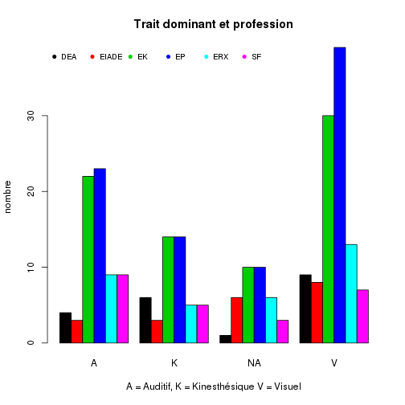
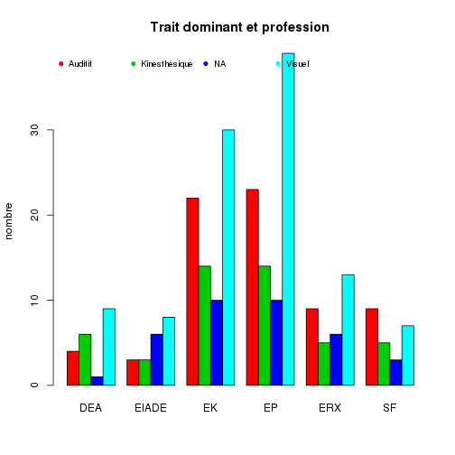
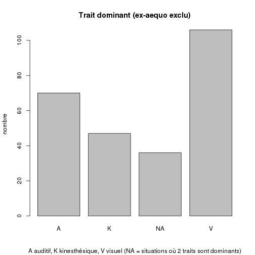
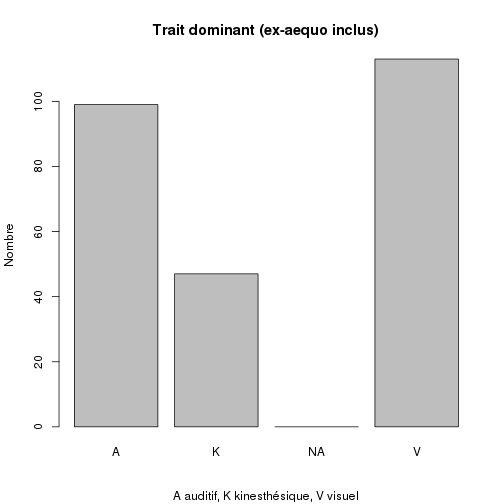

AVK Analyse
========================================================


```r
date()
```

```
## [1] "Tue Sep 17 18:54:50 2013"
```

```r
getwd()
```

```
## [1] "/home/jcb/Documents/CESU/Travaux/AVK/AVK_Rmd"
```

```r
avk <- read.csv("../data/TABLEAU_AVK7.csv", header = TRUE, sep = ",")
# élimination d'une valeur fausse;
avk[203, 13] <- NA
avk$age <- 2013 - avk$année.de.naissance

names(avk)
```

```
##  [1] "candidat"           "metier"             "session"           
##  [4] "année.de.naissance" "sexe"               "Q2"                
##  [7] "Q3"                 "Q4"                 "Q5"                
## [10] "Q6"                 "Q7"                 "Q8"                
## [13] "Q9"                 "Q10"                "Q11"               
## [16] "Q12"                "Q13"                "Q14"               
## [19] "Q15"                "Q16"                "age"
```

```r
str(avk)
```

```
## 'data.frame':	259 obs. of  21 variables:
##  $ candidat          : int  1 2 3 4 5 6 7 8 9 10 ...
##  $ metier            : Factor w/ 6 levels "DEA","EIADE",..: 6 6 6 6 6 6 6 6 6 6 ...
##  $ session           : int  2013 2013 2013 2013 2013 2013 2013 2013 2013 2013 ...
##  $ année.de.naissance: int  1989 1990 1988 1990 1989 1989 1989 1989 1990 1989 ...
##  $ sexe              : Factor w/ 2 levels "F","H": 1 1 1 1 1 1 1 1 1 1 ...
##  $ Q2                : Factor w/ 3 levels "A","K","V": 3 3 3 1 2 3 3 3 3 2 ...
##  $ Q3                : Factor w/ 3 levels "A","K","V": 3 3 2 2 3 2 3 2 3 3 ...
##  $ Q4                : Factor w/ 3 levels "A","K","V": 2 1 3 3 1 1 1 1 1 1 ...
##  $ Q5                : Factor w/ 3 levels "A","K","V": 1 1 3 1 3 2 2 1 1 1 ...
##  $ Q6                : Factor w/ 3 levels "A","K","V": 1 2 1 2 2 2 1 2 2 3 ...
##  $ Q7                : Factor w/ 3 levels "A","K","V": 2 2 NA 3 1 2 2 1 2 1 ...
##  $ Q8                : Factor w/ 3 levels "A","K","V": 2 2 2 3 3 1 3 1 1 1 ...
##  $ Q9                : Factor w/ 3 levels "A","K","V": 1 1 3 1 1 1 1 3 1 1 ...
##  $ Q10               : Factor w/ 3 levels "A","K","V": 1 2 2 3 3 2 2 3 1 2 ...
##  $ Q11               : Factor w/ 3 levels "A","K","V": 1 1 2 3 3 1 3 3 1 3 ...
##  $ Q12               : Factor w/ 3 levels "A","K","V": 2 2 2 2 2 2 2 3 2 2 ...
##  $ Q13               : Factor w/ 4 levels "A","K","KA","V": 2 2 2 2 NA 4 4 1 1 4 ...
##  $ Q14               : Factor w/ 3 levels "A","K","V": 3 3 1 3 1 2 2 3 1 3 ...
##  $ Q15               : Factor w/ 3 levels "A","K","V": 1 3 3 3 3 1 3 1 1 3 ...
##  $ Q16               : Factor w/ 3 levels "A","K","V": 1 1 2 3 2 1 2 2 3 2 ...
##  $ age               : num  24 23 25 23 24 24 24 24 23 24 ...
```

```r
summary(avk)
```

```
##     candidat       metier      session     année.de.naissance   sexe    
##  Min.   :  1.0   DEA  :20   Min.   :2013   Min.   :1957       F   :165  
##  1st Qu.: 65.5   EIADE:20   1st Qu.:2013   1st Qu.:1990       H   : 90  
##  Median :130.0   EK   :76   Median :2013   Median :1992       NA's:  4  
##  Mean   :130.0   EP   :86   Mean   :2013   Mean   :1990                 
##  3rd Qu.:194.5   ERX  :33   3rd Qu.:2013   3rd Qu.:1992                 
##  Max.   :259.0   SF   :24   Max.   :2013   Max.   :1994                 
##                                            NA's   :3                    
##  Q2         Q3      Q4         Q5      Q6         Q7         Q8     
##  A: 19   A   : 35   A:187   A   :115   A:104   A   : 27   A   : 72  
##  K: 29   K   : 57   K: 36   K   : 67   K:113   K   :147   K   :112  
##  V:211   V   :166   V: 36   V   : 76   V: 42   V   : 80   V   : 71  
##          NA's:  1           NA's:  1           NA's:  5   NA's:  4  
##                                                                     
##                                                                     
##                                                                     
##     Q9        Q10        Q11      Q12       Q13        Q14        Q15     
##  A   :194   A   :102   A   : 94   A: 30   A   :115   A   : 84   A   : 22  
##  K   : 13   K   : 31   K   : 49   K:206   K   : 62   K   : 40   K   : 65  
##  V   : 50   V   :124   V   :115   V: 23   KA  :  1   V   :134   V   :171  
##  NA's:  2   NA's:  2   NA's:  1           V   : 79   NA's:  1   NA's:  1  
##                                           NA's:  2                        
##                                                                           
##                                                                           
##  Q16          age    
##  A: 76   Min.   :19  
##  K: 77   1st Qu.:21  
##  V:106   Median :21  
##          Mean   :23  
##          3rd Qu.:23  
##          Max.   :56  
##          NA's   :3
```

```r
plot(avk$Q2, main = "Question 2", xlab = "A auditif, K kinesthésique, V visuel", 
    ylab = "effectifs")
```

 

AVK selon le diplome:
---------------------

```r
t <- table(avk$metier, avk$Q2)
t
```

```
##        
##          A  K  V
##   DEA    3  3 14
##   EIADE  0  2 18
##   EK     3  8 65
##   EP     7 10 69
##   ERX    4  3 26
##   SF     2  3 19
```

```r
round(prop.table(t, margin = 1) * 100, 2)
```

```
##        
##             A     K     V
##   DEA   15.00 15.00 70.00
##   EIADE  0.00 10.00 90.00
##   EK     3.95 10.53 85.53
##   EP     8.14 11.63 80.23
##   ERX   12.12  9.09 78.79
##   SF     8.33 12.50 79.17
```

```r


for (i in 6:20) {
    print("")
    print(paste("Question", i))
    t <- table(avk$metier, avk[, i])
    print(round(prop.table(t, margin = 1) * 100, 2))
}
```

```
## [1] ""
## [1] "Question 6"
##        
##             A     K     V
##   DEA   15.00 15.00 70.00
##   EIADE  0.00 10.00 90.00
##   EK     3.95 10.53 85.53
##   EP     8.14 11.63 80.23
##   ERX   12.12  9.09 78.79
##   SF     8.33 12.50 79.17
## [1] ""
## [1] "Question 7"
##        
##             A     K     V
##   DEA    5.00 40.00 55.00
##   EIADE 10.00 20.00 70.00
##   EK    13.16 18.42 68.42
##   EP    17.44 16.28 66.28
##   ERX   12.50 37.50 50.00
##   SF    12.50 20.83 66.67
## [1] ""
## [1] "Question 8"
##        
##             A     K     V
##   DEA   60.00 15.00 25.00
##   EIADE 45.00 25.00 30.00
##   EK    77.63 11.84 10.53
##   EP    74.42 16.28  9.30
##   ERX   72.73 12.12 15.15
##   SF    79.17  4.17 16.67
## [1] ""
## [1] "Question 9"
##        
##             A     K     V
##   DEA   55.00 40.00  5.00
##   EIADE 25.00 40.00 35.00
##   EK    44.00 28.00 28.00
##   EP    45.35 16.28 38.37
##   ERX   39.39 33.33 27.27
##   SF    58.33 20.83 20.83
## [1] ""
## [1] "Question 10"
##        
##             A     K     V
##   DEA   25.00 50.00 25.00
##   EIADE 40.00 45.00 15.00
##   EK    39.47 43.42 17.11
##   EP    39.53 44.19 16.28
##   ERX   51.52 33.33 15.15
##   SF    41.67 50.00  8.33
## [1] ""
## [1] "Question 11"
##        
##             A     K     V
##   DEA   10.00 50.00 40.00
##   EIADE 21.05 63.16 15.79
##   EK    14.47 55.26 30.26
##   EP     4.76 55.95 39.29
##   ERX    6.06 66.67 27.27
##   SF    18.18 63.64 18.18
## [1] ""
## [1] "Question 12"
##        
##             A     K     V
##   DEA   35.00 30.00 35.00
##   EIADE 20.00 30.00 50.00
##   EK    25.33 53.33 21.33
##   EP    24.71 47.06 28.24
##   ERX   32.26 38.71 29.03
##   SF    45.83 33.33 20.83
## [1] ""
## [1] "Question 13"
##        
##             A     K     V
##   DEA   70.00  5.00 25.00
##   EIADE 73.68  0.00 26.32
##   EK    77.33  4.00 18.67
##   EP    73.26  6.98 19.77
##   ERX   69.70  9.09 21.21
##   SF    91.67  0.00  8.33
## [1] ""
## [1] "Question 14"
##        
##             A     K     V
##   DEA   35.00 30.00 35.00
##   EIADE 50.00 15.00 35.00
##   EK    33.33  6.67 60.00
##   EP    43.02 10.47 46.51
##   ERX   43.75  9.38 46.88
##   SF    37.50 20.83 41.67
## [1] ""
## [1] "Question 15"
##        
##             A     K     V
##   DEA   35.00 30.00 35.00
##   EIADE 42.11 10.53 47.37
##   EK    31.58 18.42 50.00
##   EP    37.21 20.93 41.86
##   ERX   45.45 15.15 39.39
##   SF    33.33 16.67 50.00
## [1] ""
## [1] "Question 16"
##        
##             A     K     V
##   DEA   10.00 80.00 10.00
##   EIADE 15.00 50.00 35.00
##   EK    17.11 78.95  3.95
##   EP    12.79 77.91  9.30
##   ERX    3.03 90.91  6.06
##   SF     0.00 95.83  4.17
## [1] ""
## [1] "Question 17"
##        
##             A     K    KA     V
##   DEA   65.00 25.00  0.00 10.00
##   EIADE 40.00 30.00  0.00 30.00
##   EK    43.42 26.32  1.32 28.95
##   EP    45.35 20.93  0.00 33.72
##   ERX   46.88 18.75  0.00 34.38
##   SF    30.43 30.43  0.00 39.13
## [1] ""
## [1] "Question 18"
##        
##             A     K     V
##   DEA   20.00 25.00 55.00
##   EIADE 20.00 20.00 60.00
##   EK    32.89 15.79 51.32
##   EP    34.88 12.79 52.33
##   ERX   43.75 18.75 37.50
##   SF    29.17  8.33 62.50
## [1] ""
## [1] "Question 19"
##        
##             A     K     V
##   DEA    0.00 30.00 70.00
##   EIADE  5.00 15.00 80.00
##   EK     9.21 30.26 60.53
##   EP     6.98 27.91 65.12
##   ERX   12.12 15.15 72.73
##   SF    17.39 17.39 65.22
## [1] ""
## [1] "Question 20"
##        
##             A     K     V
##   DEA   20.00 30.00 50.00
##   EIADE 35.00 25.00 40.00
##   EK    30.26 38.16 31.58
##   EP    24.42 30.23 45.35
##   ERX   33.33 12.12 54.55
##   SF    41.67 29.17 29.17
```


Diagramme en radar: 3 graphes à 15 branches

Faire la somme des lignes
-------------------------
Une ligne correspond à 1 sujet qui répond à 15 questions (Q2 à Q16) où chacune explore l'une des 3 composantes possible de la réponse: A = auditif, K = kinesthésie, V = visuel. En sommant le nombre de A, K, V par ligne on forme un score à 3 composantes pour chaque sujet.

On forme une matrice *a* = *sujet* x *Questions* (la première question, intitulée Q2, correspod à la 6ème colonne du dataframe *avk*):

```r
a <- avk[6]
for (i in 7:20) {
    a <- cbind(a, avk[i])
}
```

On forme *b*, la transposée de *a*:

```r
b <- t(a)
b <- as.data.frame(b)
```

On applique à *b* la méthode *summary* pour calculer la score akv de la ligne et on agglomère les résultats dans la matrice *d*:

```r
d <- summary(as.factor(b[, 1]))
for (i in 2:length(b)) {
    d <- rbind(d, summary(as.factor(b[, i])))
}
```

Enfin on concatène la matrice *d* (3 colonnes x 259 lignes) et la matrice *avk*:

```r
e <- cbind(avk, d)
```

```
## Warning: some row.names duplicated:
## 3,4,5,6,7,8,9,10,11,12,13,14,15,16,17,18,19,20,21,22,23,24,25,26,27,28,29,30,31,32,33,34,35,36,37,38,39,40,41,42,43,44,45,46,47,48,49,50,51,52,53,54,55,56,57,58,59,60,61,62,63,64,65,66,67,68,69,70,71,72,73,74,75,76,77,78,79,80,81,82,83,84,85,86,87,88,89,90,91,92,93,94,95,96,97,98,99,100,101,102,103,104,105,106,107,108,109,110,111,112,113,114,115,116,117,118,119,120,121,122,123,124,125,126,127,128,129,130,131,132,133,134,135,136,137,138,139,140,141,142,143,144,145,146,147,148,149,150,151,152,153,154,155,156,157,158,159,160,161,162,163,164,165,166,167,168,169,170,171,172,173,174,175,176,177,178,179,180,181,182,183,184,185,186,187,188,189,190,191,192,193,194,195,196,197,198,199,200,201,202,203,204,205,206,207,208,209,210,211,212,213,214,215,216,217,218,219,220,221,222,223,224,225,226,227,228,229,230,231,232,233,234,235,236,237,238,239,240,241,242,243,244,245,246,247,248,249,250,251,252,253,254,255,256,257,258,259
## --> row.names NOT used
```

Score par catégorie socio-professionnelle
-----------------------------------------

```r
tapply(e$A, e$metier, mean)
```

```
##   DEA EIADE    EK    EP   ERX    SF 
## 4.600 4.700 4.908 4.919 5.182 5.417
```

```r
tapply(e$K, e$metier, mean)
```

```
##   DEA EIADE    EK    EP   ERX    SF 
## 4.950 4.700 4.382 4.140 4.394 4.167
```

```r
tapply(e$V, e$metier, mean)
```

```
##   DEA EIADE    EK    EP   ERX    SF 
## 5.450 5.900 5.592 5.907 5.455 5.250
```

```r
print("Les boxplot qui suivent expriment le nombre de fois ou des réponses correspondant à un trait spécifique (auditif, visuel, kinesthésique) ont été choisies, selon la catégorie socio-professionnelle. Pour chaque question, le choix verie entre 0 et 15.")
```

```
## [1] "Les boxplot qui suivent expriment le nombre de fois ou des réponses correspondant à un trait spécifique (auditif, visuel, kinesthésique) ont été choisies, selon la catégorie socio-professionnelle. Pour chaque question, le choix verie entre 0 et 15."
```

```r
boxplot(e$A ~ e$metier, main = "Choix AUDITIF")
```

 

```r
boxplot(e$K ~ e$metier, main = "Choix KINESTHESIE")
```

 

```r
boxplot(e$V ~ e$metier, main = "Choix VISUEL")
```

 

```r

print("Pas de différence en moyenne entre les hommes et la femmes sur le choix d'une composante:")
```

```
## [1] "Pas de différence en moyenne entre les hommes et la femmes sur le choix d'une composante:"
```

```r
tapply(e$A, e$sexe, mean)
```

```
##     F     H 
## 5.006 4.867
```

```r
tapply(e$K, e$sexe, mean)
```

```
##     F     H 
## 4.267 4.433
```

```r
tapply(e$V, e$sexe, mean)
```

```
##     F     H 
## 5.673 5.700
```

Dominante
---------
Hypothèse: dans certains groupes professionnel, une des 3 traits (visuel, kinesthésique, auditif) est dominant. On trouve dans les colonnes K, V, A la somme des réponses aux questions. Pour un individu, on choisit l'item correspondant à la somme maximale. Par exemple pour le sujet 1 on a: A=7 K=5 V=3. Son trait dominant est auditif.  

On met dans la colonne e$trait, le trait dominant:

```r
source("../fct.R")
#' par défaut la fonction trait dominant élimine les ex-aequo et met NA dans la colonne trait (?)
e$trait <- as.factor(trait_dominant(e))
summary(e$trait)
```

```
##   A   K  NA   V 
##  70  47  36 106
```

#### Relation *trait* et *age*:

```r
tapply(e$age, e$trait, mean, na.rm = T)
```

```
##     A     K    NA     V 
## 22.41 24.02 23.74 22.63
```

```r
tapply(e$age, e$trait, sd, na.rm = T)
```

```
##     A     K    NA     V 
## 3.470 6.288 5.744 3.898
```

Pas de diddérence entre les groupes

#### Relation *trait* rt *métier*

```r
t <- table(e$metier, e$trait)
t
```

```
##        
##          A  K NA  V
##   DEA    4  6  1  9
##   EIADE  3  3  6  8
##   EK    22 14 10 30
##   EP    23 14 10 39
##   ERX    9  5  6 13
##   SF     9  5  3  7
```

```r
pt <- round(prop.table(t) * 100, 2)
pt
```

```
##        
##             A     K    NA     V
##   DEA    1.54  2.32  0.39  3.47
##   EIADE  1.16  1.16  2.32  3.09
##   EK     8.49  5.41  3.86 11.58
##   EP     8.88  5.41  3.86 15.06
##   ERX    3.47  1.93  2.32  5.02
##   SF     3.47  1.93  1.16  2.70
```

```r
barplot(t, beside = T, col = 1:6, main = "Trait dominant et profession", ylab = "nombre", 
    xlab = "A = Auditif, K = Kinesthésique V = Visuel")
legend("topleft", 5, pch = 19, bty = "n", horiz = T, legend = c("DEA", "EIADE", 
    "EK", "EP", "ERX", "SF"), cex = 0.8, col = 1:6)
```

 

```r

barplot(pt, beside = T, col = 1:6, main = "Trait dominant et profession", ylab = "Pourcentage", 
    xlab = "A = Auditif, K = Kinesthésique V = Visuel")
legend("topleft", 5, pch = 19, bty = "n", horiz = T, legend = c("DEA", "EIADE", 
    "EK", "EP", "ERX", "SF"), cex = 0.8, col = 1:6)
```

 

```r

barplot(t(t), beside = T, col = 2:5, main = "Profession et trait dominant", 
    ylab = "nombre", xlab = "NA correspond aux cas où 2 traits sont ex-aequo")
legend("topleft", 5, pch = 19, bty = "n", horiz = T, legend = c("Auditif", "Kinesthésique", 
    "NA", "Visuel"), cex = 0.8, col = 2:5)
```

 

```r

barplot(t(pt), beside = T, col = 2:5, main = "Profession et trait dominant", 
    ylab = "nombre", xlab = "NA correspond aux cas où 2 traits sont ex-aequo")
legend("topleft", 5, pch = 19, bty = "n", horiz = T, legend = c("Auditif", "Kinesthésique", 
    "NA", "Visuel"), cex = 0.8, col = 2:5)
```

 


Existe t-il un groupe où le trait K est dominant ?  
Pour chaque ligne, on regarde si le trait dominant est K ou non (NK):
** A revoir, le calcul est faux **

```r
for (i in 1:length(e)) {
    e$traitK[i] <- ifelse(e$K[i] == max(e[i, c("A", "K", "V")]), "K", "NK")
}
summary(as.factor(e$trait))
```

```
##   A   K  NA   V 
##  70  47  36 106
```

On refait le meme calcul pour les autres caractéristiques:

```r
for (i in 1:length(e)) {
    e$traitA[i] <- ifelse(e$A[i] == max(e[i, c("A", "K", "V")]), "A", "NA")
}
summary(as.factor(e$traitA))
```

```
##   A  NA 
## 244  15
```

```r
for (i in 1:length(e)) {
    e$traitV[i] <- ifelse(e$V[i] == max(e[i, c("A", "K", "V")]), "V", "NV")
}
summary(as.factor(e$traitV))
```

```
##  NV   V 
## 247  12
```

#### Conclusion
Les étudiants en science de la santé, quelque soit leur spécialité, sont très majoritairement des "visuels" (NB: la somme des 3 résultat dépasse le nombre de sujets en raison des ex-aequo). Génération "jeu vidéo" ?

```r
e$age <- 2013 - e$année.de.naissance
summary(e$age)
```

```
##    Min. 1st Qu.  Median    Mean 3rd Qu.    Max.    NA's 
##      19      21      21      23      23      56       3
```

sex ratio

```r
summary(e$sexe)
```

```
##    F    H NA's 
##  165   90    4
```

Analyse 2
==========


```r
source("../fct.R")
e$trait <- trait_dominant(e)
summary(as.factor(e$trait))
```

```
##   A   K  NA   V 
##  70  47  36 106
```

```r
apply(e$age, e$trait, mean, na.rm = T)
```

```
## Error: dim(X) must have a positive length
```

```r
table(e$metier, e$trait)
```

```
##        
##          A  K NA  V
##   DEA    4  6  1  9
##   EIADE  3  3  6  8
##   EK    22 14 10 30
##   EP    23 14 10 39
##   ERX    9  5  6 13
##   SF     9  5  3  7
```

```r
t <- table(e$metier, e$trait)
t
```

```
##        
##          A  K NA  V
##   DEA    4  6  1  9
##   EIADE  3  3  6  8
##   EK    22 14 10 30
##   EP    23 14 10 39
##   ERX    9  5  6 13
##   SF     9  5  3  7
```

```r
round(prop.table(t, margin = 1) * 100, 2)
```

```
##        
##             A     K    NA     V
##   DEA   20.00 30.00  5.00 45.00
##   EIADE 15.00 15.00 30.00 40.00
##   EK    28.95 18.42 13.16 39.47
##   EP    26.74 16.28 11.63 45.35
##   ERX   27.27 15.15 18.18 39.39
##   SF    37.50 20.83 12.50 29.17
```

```r
barplot(t, beside = T, col = 1:6, main = "Trait dominant et profession", ylab = "nombre", 
    xlab = "A = Auditif, K = Kinesthésique V = Visuel")
legend("topleft", 5, pch = 19, bty = "n", horiz = T, legend = c("DEA", "EIADE", 
    "EK", "EP", "ERX", "SF"), cex = 0.6, col = 1:6)
```

 

```r

barplot(t(t), beside = T, col = 2:5, main = "Trait dominant et profession", 
    ylab = "nombre", xlab = "")
legend("topleft", 5, pch = 19, bty = "n", horiz = T, legend = c("Auditif", "Kinesthésique", 
    "NA", "Visuel"), cex = 0.6, col = 2:5)
```

 

```r


tapply(e$age, e$trait, var, na.rm = T)
```

```
##     A     K    NA     V 
## 12.04 39.54 32.99 15.20
```

```r
tapply(e$age, e$trait, sd, na.rm = T)
```

```
##     A     K    NA     V 
## 3.470 6.288 5.744 3.898
```

```r


a <- summary(t(e[, c(6:20)]))
a
```

```
##  V1    V2       V3    V4       V5    V6    V7    V8    V9    V10  
##  A:7   A:5   A   :2   A:3   A   :4   A:6   A:3   A:6   A:9   A:5  
##  K:5   K:6   K   :7   K:4   K   :4   K:7   K:6   K:3   K:3   K:4  
##  V:3   V:4   V   :5   V:8   V   :6   V:2   V:6   V:6   V:3   V:6  
##              NA's:1         NA's:1                                
##                                                                   
##    V11    V12     V13    V14   V15   V16   V17   V18   V19   V20   V21  
##  A   :3   A:3   A   :7   A:5   A:6   A:4   A:6   A:9   A:8   A:7   A:3  
##  K   :5   K:3   K   :2   K:6   K:4   K:6   K:3   K:2   K:2   K:3   K:3  
##  V   :6   V:9   V   :5   V:4   V:5   V:5   V:6   V:4   V:5   V:5   V:9  
##  NA's:1         NA's:1                                                  
##                                                                         
##  V22   V23   V24   V25   V26   V27   V28   V29   V30   V31   V32   V33  
##  A:7   A:5   A:7   A:4   A:5   A:3   A:3   A:3   A:8   A:6   A:4   A:5  
##  K:6   K:3   K:3   K:6   K:3   K:6   K:5   K:3   K:4   K:4   K:4   K:3  
##  V:2   V:7   V:5   V:5   V:7   V:6   V:7   V:9   V:3   V:5   V:7   V:7  
##                                                                         
##                                                                         
##  V34   V35   V36   V37   V38   V39   V40   V41   V42   V43     V44   
##  A:6   A:7   A:7   A:2   A:6   A:6   A:5   A:2   A:4   A:6   A   :2  
##  K:5   K:6   K:3   K:6   K:2   K:5   K:6   K:8   K:8   K:3   K   :6  
##  V:4   V:2   V:5   V:7   V:7   V:4   V:4   V:5   V:3   V:6   V   :5  
##                                                              NA's:2  
##                                                                      
##  V45   V46   V47   V48   V49   V50   V51   V52   V53   V54   V55   V56  
##  A:4   A:6   A:2   A:4   A:4   A:7   A:2   A:5   A:9   A:6   A:3   A:2  
##  K:7   K:4   K:7   K:5   K:3   K:2   K:9   K:4   K:2   K:4   K:6   K:7  
##  V:4   V:5   V:6   V:6   V:8   V:6   V:4   V:6   V:4   V:5   V:6   V:6  
##                                                                         
##                                                                         
##  V57   V58   V59     V60    V61   V62   V63   V64   V65    V66   V67  
##  A:6   A:7   A:7   A   :7   A:4   A:3   A:4   A:8   A: 2   A:5   A:5  
##  K:3   K:2   K:1   V   :7   K:3   K:9   K:5   K:4   K: 3   K:5   K:4  
##  V:6   V:6   V:7   NA's:1   V:8   V:3   V:6   V:3   V:10   V:5   V:6  
##                                                                       
##                                                                       
##    V68    V69   V70   V71      V72    V73   V74   V75   V76    V77   V78  
##  A   :7   A:1   A:7   A: 3   K   :7   A:3   A:3   A:4   A: 1   A:5   A:4  
##  K   :4   K:7   V:8   K: 2   V   :7   K:9   K:5   K:4   K: 2   K:5   K:4  
##  V   :3   V:7         V:10   NA's:1   V:3   V:7   V:7   V:12   V:5   V:7  
##  NA's:1                                                                   
##                                                                           
##  V79   V80   V81   V82   V83   V84   V85   V86   V87   V88   V89   V90  
##  A:3   A:4   A:7   A:4   A:7   A:6   A:3   A:5   A:5   A:6   A:5   A:4  
##  K:7   K:4   K:6   K:2   K:4   K:4   K:4   K:2   K:6   K:3   K:3   K:5  
##  V:5   V:7   V:2   V:9   V:4   V:5   V:8   V:8   V:4   V:6   V:7   V:6  
##                                                                         
##                                                                         
##    V91      V92    V93   V94   V95   V96   V97   V98   V99   V100  V101 
##  A   :3   A   :6   A:4   A:3   A:1   A:7   A:5   A:4   A:4   A:6   A:1  
##  K   :3   K   :2   K:4   K:3   K:9   K:3   K:6   K:4   K:5   K:6   K:6  
##  V   :8   V   :6   V:7   V:9   V:5   V:5   V:4   V:7   V:6   V:3   V:8  
##  NA's:1   NA's:1                                                        
##                                                                         
##    V102   V103  V104  V105  V106  V107  V108  V109  V110  V111  V112 
##  A   :6   A:7   A:3   A:8   A:7   A:7   A:3   A:2   A:7   A:4   A:3  
##  K   :5   K:3   K:4   K:1   K:3   K:3   K:9   K:8   K:6   K:5   K:7  
##  V   :3   V:5   V:8   V:6   V:5   V:5   V:3   V:5   V:2   V:6   V:5  
##  NA's:1                                                              
##                                                                      
##  V113  V114  V115  V116  V117  V118  V119   V120  V121  V122  V123  V124 
##  A:7   A:4   A:7   A:7   A:6   A:3   A:11   A:4   A:5   A:5   A:2   A:7  
##  K:4   K:3   K:2   K:3   K:4   K:4   K: 1   K:2   K:4   K:2   K:6   K:1  
##  V:4   V:8   V:6   V:5   V:5   V:8   V: 3   V:9   V:6   V:8   V:7   V:7  
##                                                                          
##                                                                          
##  V125  V126  V127  V128  V129  V130  V131  V132  V133  V134  V135  V136 
##  A:2   A:7   A:3   A:3   A:6   A:4   A:6   A:3   A:6   A:2   A:9   A:8  
##  K:7   K:2   K:6   K:3   K:4   K:7   K:5   K:7   K:2   K:6   K:5   K:3  
##  V:6   V:6   V:6   V:9   V:5   V:4   V:4   V:5   V:7   V:7   V:1   V:4  
##                                                                         
##                                                                         
##  V137  V138  V139  V140  V141  V142  V143   V144  V145  V146  V147  V148 
##  A:7   A:3   A:5   A:3   A:6   A:3   A: 3   A:5   A:4   A:6   A:5   A:5  
##  K:5   K:3   K:4   K:4   K:1   K:3   K: 2   K:5   K:6   K:4   K:3   K:4  
##  V:3   V:9   V:6   V:8   V:8   V:9   V:10   V:5   V:5   V:5   V:7   V:6  
##                                                                          
##                                                                          
##  V149  V150  V151  V152  V153  V154  V155  V156  V157  V158  V159  V160 
##  A:3   A:9   A:6   A:6   A:6   A:5   A:4   A:4   A:4   A:4   A:5   A:7  
##  K:3   K:3   K:6   K:2   K:2   K:3   K:6   K:6   K:4   K:5   K:5   K:1  
##  V:9   V:3   V:3   V:7   V:7   V:7   V:5   V:5   V:7   V:6   V:5   V:7  
##                                                                         
##                                                                         
##  V161   V162  V163  V164  V165  V166  V167  V168  V169  V170  V171  V172 
##  A: 3   A:6   A:4   A:8   A:5   A:7   A:5   A:3   A:6   A:7   A:4   A:5  
##  K: 2   K:7   K:5   K:2   K:5   K:4   K:2   K:7   K:7   K:6   K:5   K:3  
##  V:10   V:2   V:6   V:5   V:5   V:4   V:8   V:5   V:2   V:2   V:6   V:7  
##                                                                          
##                                                                          
##  V173  V174   V175  V176  V177  V178  V179  V180  V181  V182  V183  V184 
##  A:4   A: 1   A:3   A:3   A:4   A:8   A:5   A:3   A:4   A:3   A:2   A:5  
##  K:6   K: 4   K:5   K:4   K:5   K:5   K:6   K:7   K:6   K:5   K:5   K:3  
##  V:5   V:10   V:7   V:8   V:6   V:2   V:4   V:5   V:5   V:7   V:8   V:7  
##                                                                          
##                                                                          
##  V185  V186  V187  V188  V189  V190    V191   V192  V193  V194  V195 
##  A:6   A:6   A:3   A:6   A:6   A:8   A   :4   A:3   A:4   A:8   A:6  
##  K:6   K:5   K:6   K:6   K:2   K:2   K   :7   K:6   K:5   K:3   K:2  
##  V:3   V:4   V:6   V:3   V:7   V:5   V   :3   V:6   V:6   V:4   V:7  
##                                      NA's:1                          
##                                                                      
##  V196  V197  V198  V199  V200  V201  V202    V203   V204  V205  V206 
##  A:4   A:5   A:2   A:5   A:4   A:3   A:3   A   :4   A:9   A:5   A:6  
##  K:2   K:5   K:6   K:6   K:4   K:7   K:8   K   :4   K:1   K:2   K:3  
##  V:9   V:5   V:7   V:4   V:7   V:5   V:4   KA  :1   V:5   V:8   V:6  
##                                            V   :5                    
##                                            NA's:1                    
##  V207  V208  V209  V210  V211  V212  V213  V214  V215  V216  V217  V218 
##  A:5   A:4   A:7   A:7   A:4   A:9   A:1   A:7   A:6   A:5   A:5   A:4  
##  K:4   K:6   K:4   K:2   K:4   K:2   K:5   K:4   K:2   K:4   K:2   K:5  
##  V:6   V:5   V:4   V:6   V:7   V:4   V:9   V:4   V:7   V:6   V:8   V:6  
##                                                                         
##                                                                         
##  V219  V220  V221  V222  V223  V224  V225  V226  V227  V228  V229  V230 
##  A:7   A:7   A:4   A:6   A:6   A:7   A:3   A:4   A:4   A:6   A:5   A:8  
##  K:3   K:3   K:3   K:5   K:1   K:2   K:5   K:5   K:5   K:3   K:5   K:2  
##  V:5   V:5   V:8   V:4   V:8   V:6   V:7   V:6   V:6   V:6   V:5   V:5  
##                                                                         
##                                                                         
##  V231  V232  V233  V234  V235  V236  V237  V238  V239  V240  V241  V242 
##  A:3   A:5   A:6   A:5   A:7   A:4   A:9   A:5   A:4   A:2   A:5   A:3  
##  K:4   K:7   K:2   K:6   K:5   K:3   K:4   K:3   K:4   K:4   K:6   K:5  
##  V:8   V:3   V:7   V:4   V:3   V:8   V:2   V:7   V:7   V:9   V:4   V:7  
##                                                                         
##                                                                         
##    V243   V244  V245  V246  V247  V248  V249  V250  V251  V252  V253 
##  A   :5   A:6   A:7   A:5   A:4   A:5   A:6   A:7   A:6   A:6   A:7  
##  K   :4   K:6   V:8   K:1   K:7   K:5   K:4   K:5   K:5   K:4   K:3  
##  V   :4   V:3         V:9   V:4   V:5   V:5   V:3   V:4   V:5   V:5  
##  NA's:2                                                              
##                                                                      
##  V254  V255    V256   V257  V258    V259  
##  A:4   A:5   A   :3   A:6   A:6   A   :2  
##  K:5   K:4   K   :4   K:3   K:6   K   :3  
##  V:6   V:6   V   :6   V:6   V:3   V   :8  
##              NA's:2               NA's:2  
## 
```

```r

a <- trait_dominant(e)
s <- summary(as.factor(a))
t <- round(prop.table(as.table(s)) * 100, 2)
r <- rbind(s, t)
row.names(r) <- c("n", "%")
r
```

```
##       A     K   NA      V
## n 70.00 47.00 36.0 106.00
## % 27.03 18.15 13.9  40.93
```

```r
barplot(r[1, ], main = "Trait dominant (ex-aequo exclu)", ylab = "nombre", sub = "A auditif, K kinesthésique, V visuel (NA = situations où 2 traits sont dominants)")
```

 

```r

barplot(r[2, ], main = "Trait dominant (ex-aequo exclu)", ylab = "Pourcentage (%)", 
    sub = "A auditif, K kinesthésique, V visuel (NA = situations où 2 traits sont dominants)")
```

 

```r

a <- trait_dominant(e, ties = F)
s <- summary(as.factor(a))
t <- round(prop.table(as.table(s)) * 100, 2)
r <- rbind(s, t)
row.names(r) <- c("n", "%")
r
```

```
##       A     K NA      V
## n 99.00 47.00  0 113.00
## % 38.22 18.15  0  43.63
```

```r
barplot(r[1, ], main = "Trait dominant (ex-aequo inclus)", ylab = "Nombre", 
    sub = "A auditif, K kinesthésique, V visuel")
```

 

```r
barplot(r[2, ], main = "Trait dominant (ex-aequo inclus)", ylab = "Pourcentage (%)", 
    sub = "A auditif, K kinesthésique, V visuel")
```

 


```
## % latex table generated in R 2.15.1 by xtable 1.7-1 package
## % Tue Sep 17 18:54:52 2013
## \begin{table}[ht]
## \centering
## \begin{tabular}{rrrrr}
##   \hline
##  & A & K & NA & V \\ 
##   \hline
## n & 99.00 & 47.00 & 0.00 & 113.00 \\ 
##   \% & 38.22 & 18.15 & 0.00 & 43.63 \\ 
##    \hline
## \end{tabular}
## \end{table}
```


